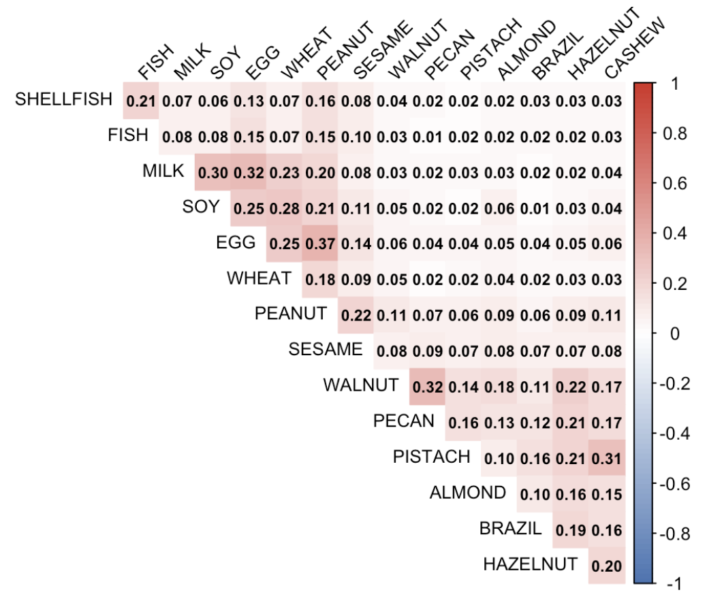
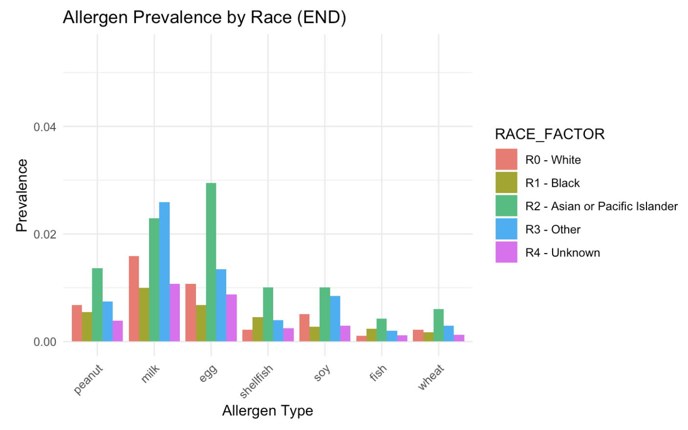

# Introduction

This report investigates food allergies in children using a publicly available data set. The goal is to identify common allergens and trends over time, providing insights for causes and the impact of food allergies.

# Methodology

-   Data Source: Data set from [Zenodo](https://zenodo.org/records/44529) containing +330,000 children medical records from The Children’s Hospital of Philadelphia.
-   Tools: R Studio, `tidyverse`, `lubridate`, `ggplot2`, `corrplot`.
-   Steps: Data cleaning, visualization, statistical analysis.

# Key Findings

### Overall Prevalence Patterns
- Peanut allergies are the most common (>0.02 prevalence), followed by milk and egg allergies.
- Brazil nut and other tree nut allergies exhibit the lowest prevalence (<0.005).
- This hierarchy of allergen prevalence remains relatively stable throughout the observation period.

### Demographic Distribution
- Males show consistently higher prevalence of all food allergies compared to females.
- Asian/Pacific Islander populations have notably higher rates of egg and milk allergies (approximately 0.02 prevalence difference) relative to other racial groups.
- Racial disparities are especially evident in egg allergies, where Asian/Pacific Islanders show significantly higher prevalence than other populations.

### Temporal Trends
- Allergy prevalence by birth year shows a clear upward trend from the 1980s through the 2010s.
- Prevalence rose from nearly 0 to over 0.025, indicating that environmental or diagnostic factors may be contributing to increased allergy rates over time.

# Visual Highlights

  
*Figure 1: Matrix of allergen correlation.*

  
*Figure 2: Allergen prevalence in different races.*

# Limitations

- The dataset only includes patients from a single hospital.
- Some entries had missing or inconsistent data.
- Findings are observational.

# Conclusion

This project sheds light on patterns in pediatric food allergies using large-scale clinical data. The insights could inform public health strategies and raise awareness of high-risk groups.

# Project Files

- [Full R Script](allergy_analysis.Rmd)
- [Report PDF](allergy_analysis.pdf)
- [Report Markdown HTML](allergy_analysis.html)

# Citation

Dataset from:  
[Zenodo](https://zenodo.org/records/44529)

Hill, David A et al. “The epidemiologic characteristics of healthcare provider-diagnosed eczema, asthma, allergic rhinitis, and food allergy in children: a retrospective cohort study.” BMC pediatrics vol. 16 133. 20 Aug. 2016, doi:10.1186/s12887-016-0673-z

[Link to PMC Article](https://pmc.ncbi.nlm.nih.gov/articles/PMC4992234/)
